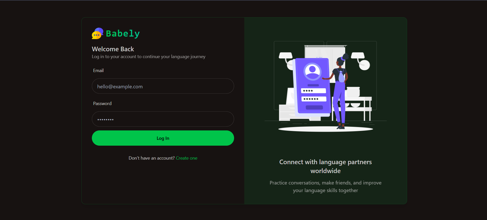
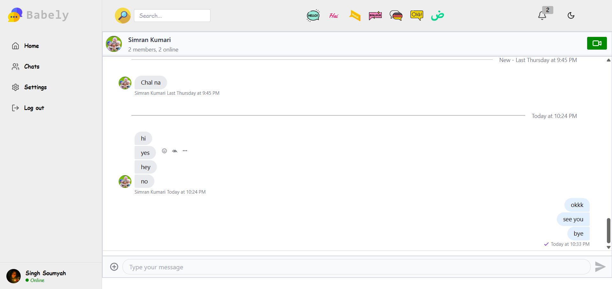

#  Babely
**Learn Languages by Connecting with Native Speakers — Real-Time Video & Chat**


[](https://github.com/badalraj444/Babely)
[](https://github.com/badalraj444/Babely/fork)
[](https://github.com/badalraj444/Babely/issues)
[](LICENSE)
[](http://makeapullrequest.com)

---

## 🚀 Live Demo
🔗 **[Try Babely here](https://babely.onrender.com)**

---

## ✨ Features
- 🔍 **Search Users** – Find language partners by name or language.  
- 🤝 **Smart Matching** – Auto-pairs learners with native speakers based on native & target languages.  
- 📊 **Personalized Learning** – Tracks goals, proficiency, and progress to customize topics.  
- 💬 **Real-time Chat & Video** – Practice in context with Stream Chat & Video React SDK.  
- 🛡 **Protected Routes** – Only authenticated users can access sessions.  
- ♻ **Reusable Components** – Custom hooks and centralized API layer for rapid dev.  
- 🎯 **Guided Onboarding** – Set goals and optimize matches from day one.

---

## 🛠 Tech Stack

**Frontend**
- React.js + Vite  
- Tailwind CSS + DaisyUI  
- @tanstack/react-query  
- Stream Chat & Video React SDK  
- Axios  

**Backend**
- Node.js + Express.js  
- MongoDB + Mongoose  
- JWT Authentication + bcryptjs  
- cookie-parser, cors, dotenv  

**Dev Tools**
- nodemon, Vite, Postman  
- Docker (optional)  

---

## 📦 Getting Started

### Prerequisites
- Node.js (v18+)  
- npm or Yarn  
- MongoDB (local or Atlas)  
- Stream API Key & Secret ([getstream.io](https://getstream.io/))

### Installation

1. **Clone the repo**
```bash
git clone https://github.com/badalraj444/Babely.git
cd Babely
```

2. **Install dependencies**
```bash
npm install --prefix backend
npm install --prefix client
```

3. **Set up environment variables**
Create `.env` in `backend/`:
```env
MONGO_URL=<Your MongoDB connection URI>
JWT_SECRET_KEY=<Your JWT secret>
STREAM_API_KEY=<Your Stream API key>
STREAM_SECRET=<Your Stream API secret>
PORT=5000
NODE_ENV=development
```

4. **Run locally**
```bash
# Backend
npm run dev --prefix backend

# Frontend (in another terminal)
npm run dev --prefix client
```
- **Frontend:** http://localhost:5173  
- **Backend API:** http://localhost:5000/api  

---

## 📖 Usage
1. **Sign Up / Login** – Create an account with your native & target language.  
2. **Onboarding** – Set your goals and preferences.  
3. **Find Partners** – Search or auto-match with native speakers.  
4. **Practice Sessions** – Video call & chat tailored to your proficiency.  
5. **Track Progress** – Monitor vocabulary, grammar, and conversation milestones.

---

## 📂 Project Structure
```
Babely/
├── backend/
│   ├── src/
│   │   ├── controllers/
│   │   ├── lib/          # DB, Stream client, matching logic
│   │   ├── middleware/
│   │   ├── models/
│   │   ├── routes/
│   │   └── server.js
│   ├── package.json
│   └── .env.example
├── client/
│   ├── public/
│   ├── src/
│   ├── tailwind.config.js
│   ├── vite.config.js
│   └── package.json
├── package.json
└── README.md
```

---

## 📷 Screenshots

**Login Page**  


**Home Page**  


**Chats Page**  


**Chat Window**  


**Settings & Controls**  


---

## 🤝 Contributing
Contributions are welcome!  
- Open issues or submit PRs to improve matching, UI/UX, or learning features.

---

## 📜 License
Distributed under the MIT License. See [LICENSE](LICENSE) for details.

---

⭐ **If you like Babely, please consider giving it a star on GitHub — it helps more people discover the project!** ⭐

---

<!-- keywords: language learning, babely, react language chat, video call language exchange, learn with native speakers, babely onrender -->
