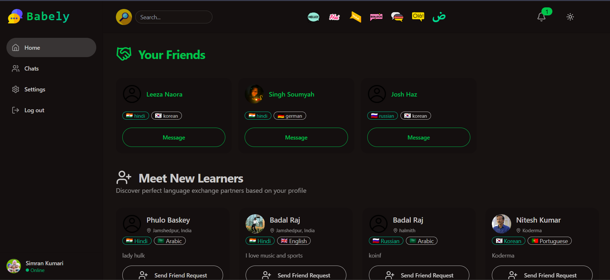
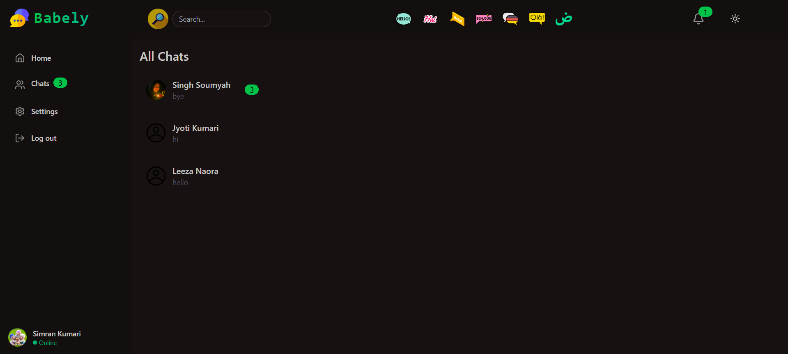
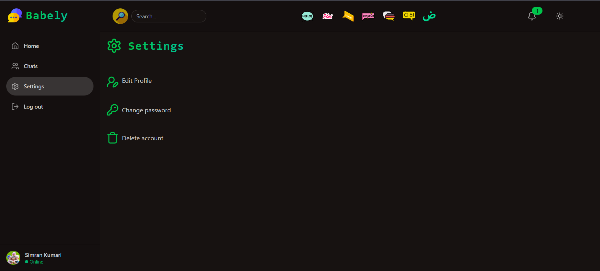

# Babely

Babely is a full‑stack language learning platform that connects users with native-speaking language partners for real‑time video calls and chat. By considering each user’s native language and personalized learning data, Babely offers tailored practice sessions and meaningful cultural exchange.

## Table of Contents

- [Features](#features)  
- [Tech Stack](#tech-stack)  
- [Getting Started](#getting-started)  
  - [Prerequisites](#prerequisites)  
  - [Installation](#installation)  
  - [Environment Variables](#environment-variables)  
  - [Running Locally](#running-locally)  
- [Usage](#usage)  
- [Project Structure](#project-structure)  
- [Contributing](#contributing)  
- [License](#license)  

---

## Features

- **Language Partner Matching**: Automatically pair learners with native speakers based on selected target and native languages.  
- **Personalized Learning Data**: Track each user’s language proficiency, learning goals, and progress to customize session topics.  
- **Real‑time Chat & Video**: Practice speaking and writing in context, powered by Stream Chat and Stream Video React SDK.  
- **Guided Onboarding**: Collect user details (native language, target language, proficiency level) to optimize matches.  
- **32 UI Themes**: Personalize your experience with multiple theme options.  
- **Protected Routes**: Ensure only authenticated users access learning sessions.  
- **Custom Hooks & Components**: Reusable React hooks and a centralized API layer for rapid development.  

---

## Tech Stack

- **Frontend**  
  - React.js & Vite  
  - Tailwind CSS & DaisyUI  
  - @tanstack/react-query  
  - Stream Chat & Video React SDK  
  - Axios  

- **Backend**  
  - Node.js & Express.js  
  - MongoDB (Mongoose)  
  - JWT Authentication & bcryptjs  
  - cookie-parser, cors, dotenv  
  - Matching logic for partner pairing  

- **Dev Tools**  
  - nodemon, Vite, Postman  
  - Docker (optional)  

---

## Getting Started

### Prerequisites

- Node.js (v18+)  
- npm or Yarn  
- MongoDB (local or Atlas)  
- Stream API Key & Secret (from [getstream.io](https://getstream.io/))

### Installation

1. **Clone the repo**  
   ```bash
   git clone https://github.com/badalraj444/Babely.git
   cd Babely-main
   ```

2. **Install dependencies**  
   ```bash
   npm install --prefix backend
   npm install --prefix client
   ```

### Environment Variables

Create a `.env` file inside `backend/`:

```env
MONGO_URL=<Your MongoDB connection URI>
JWT_SECRET_KEY=<Your JWT secret>
STREAM_API_KEY=<Your Stream API key>
STREAM_SECRET=<Your Stream API secret>
PORT=5000
NODE_ENV=development
```

### Running Locally

```bash
# In one terminal:
npm run dev --prefix backend

# In another:
npm run dev --prefix client
```

- **Frontend:** http://localhost:5173  
- **Backend API:** http://localhost:5000/api  

For production:

```bash
npm run build      # builds client
npm start --prefix backend
```

---

## Usage

1. **Sign Up / Login** – Register with email, password, native and target language details.  
2. **Onboarding** – Complete your profile and set learning goals.  
3. **Find Partners** – Browse or get matched with native speakers.  
4. **Practice Sessions** – Engage in paired video calls and chat focusing on your proficiency level.  
5. **Progress Tracking** – Monitor your vocabulary, grammar, and conversation milestones.

---

## Project Structure

```
Babely-main/
├── backend/
│   ├── src/
│   │   ├── controllers/
│   │   ├── lib/            # DB, Stream client & matching logic setup
│   │   ├── middleware/
│   │   ├── models/
│   │   ├── routes/
│   │   └── server.js
│   ├── package.json
│   └── .env.example
├── client/
│   ├── public/
│   ├── src/
│   ├── tailwind.config.js
│   ├── vite.config.js
│   └── package.json
├── package.json
└── README.md
```

---

## Screenshots




## Contributing

Contributions welcome! Open issues or pull requests to improve matching, UI/UX, and learning features.

---

## License

Distributed under the MIT License. See [LICENSE](LICENSE) for details.
